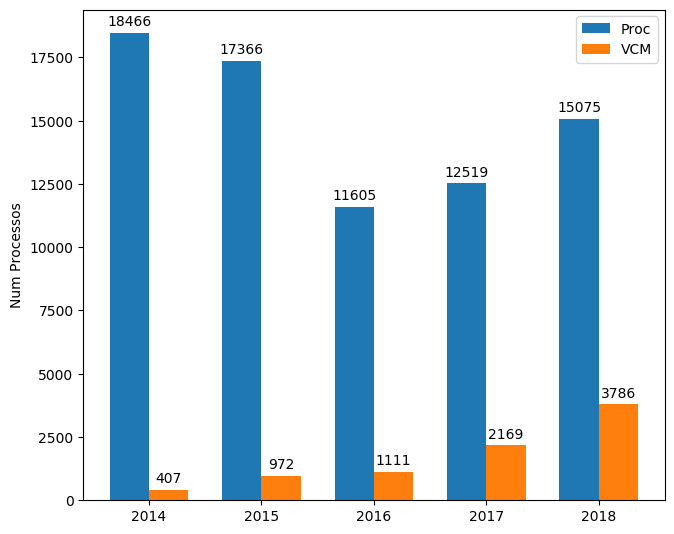

# Violência contra a mulher no estado de PE
*trabalho em andamento*

### Aqui você irá encontrar uma breve análise dos casos de violência contra a mulher ocorridos no estado de PE
Os dados foram adquiridos utilizando a API fornecida pelo TJPE.

Foram realizados a captura dos processos fisícos presentes na 1ª vara da capital do recife, nos anos de 2011 ate 2018.

-----------
### Links úteis:
* [Manual WerbService do TJPE](http://www.tjpe.jus.br/consulta/processual/1grau/manuais)
* [Consulta de processos físicos e eletrônicos, 1ª ou 2ª Grau no TJPE](https://srv01.tjpe.jus.br/consultaprocessualunificada/processo/)
* [Consulta de processos eletrônicos, de 1ª Grau, no sistema PJe - TJPE](https://pje.tjpe.jus.br/1g/ConsultaPublica/listView.seam)
* [Padronização no número dos processos](http://www.cnj.jus.br/programas-e-acoes/pj-numeracao-unica)
* Varas de Violência Contra a Mulher - TJPE (~link quebrado~) -> O TJPE possui dez varas instaladas ao longo do estado. 

------------
### Materiais:
* [Cartilha Lei Maria da Penha - Perguntas e Respostas](https://www12.senado.leg.br/institucional/procuradoria/proc-publicacoes/cartilha-lei-maria-da-penha-perguntas-e-respostas)
* [Cadastro Nacional de Violência Doméstica](http://www.cnmp.mp.br/portal/violencia-domestica)
  * [Painel do Cadastro Nacional de Violência Doméstica](https://public.tableau.com/profile/cnmp#!/vizhome/CadastroNacionaldeViolnciaDomstica/CadastroNacionaldeViolnciaDomstica) -> Dados dos anos de 2017 ate 20
* [Observatório da Mulher contra a Violência](https://www12.senado.leg.br/institucional/omv)
  * [Painel de Violência contra Mulheres](http://www9.senado.gov.br/QvAJAXZfc/opendoc.htm?document=senado%2FPainel%20OMV%20-%20Viol%C3%AAncia%20contra%20Mulheres.qvw&host=QVS%40www9&anonymous=true) -> Dados a partir de 11 de julho de 2017 até 8 de maio de 2019.
* [O poder judiciário na aplicação da lei maria da penha](http://cnj.jus.br/files/publicacoes/arquivo/5514b0debfb866190c20610890849e10_1c3f3d621da010274f3d69e6a6d6b7e6.pdf)
* [Violência contra as mulheres em dados](https://dossies.agenciapatriciagalvao.org.br/violencia-em-dados/sobre-esta-plataforma/) -> Plataforma reúne pesquisas, fontes e sínteses sobre dados recentes relacionates às violências contra as mulheres. 
* [Relógios da Violência](http://www.relogiosdaviolencia.com.br/#)
* [Justiça de Saia](http://www.justicadesaia.com.br/)
  * [Cartilha mapa da violência contra a mulher](http://www.justicadesaia.com.br/cartilha-mapa-da-violencia-contra-a-mulher-2018/) -> Dados obtidos a partir de 140 mil nóticias, onde 68mil foram relacionadas a casos de violência contra a mulher ao longo de 2018.
* [Panorama da Violência contra as mulheres no Brasil no ano de 2018](http://www.senado.gov.br/institucional/datasenado/omv/indicadores/relatorios/BR-2018.pdf)
  
----------------
### Notícias:
* [Varas de violência doméstica chegam a todos os tribunais](https://public.tableau.com/profile/cnmp#!/vizhome/CadastroNacionaldeViolnciaDomstica/CadastroNacionaldeViolnciaDomstica)
* [Justiça mais eficaz no enfrentamento à violência contra a mulher](http://cnj.jus.br/noticias/cnj/87010-justica-mais-eficaz-no-enfrentamento-a-violencia-contra-a-mulher)
* [2ª Vara de Violência Doméstica implanta método de atendimento pioneiro às mulheres em situação de violência](http://www.tjpe.jus.br/-/2-vara-de-violencia-domestica-implanta-metodo-de-atendimento-pioneiro-as-mulheres-em-situacao-de-violencia)
* [EM NÚMEROS: A violência contra a mulher brasileira, por Nana Soares](https://emais.estadao.com.br/blogs/nana-soares/em-numeros-a-violencia-contra-a-mulher-brasileira/)
* [Banco de dados unificado sobre violência contra as mulheres é aprovado na CDH e segue para a CCJ](http://www.compromissoeatitude.org.br/apos-polemica-banco-de-dados-de-violencia-contra-as-mulheres-e-aprovado-na-cdh/) -> nóticia de 12/12/18
