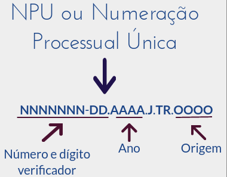

# Introdução {.tabset }

## Lei Maria da Penha

No ano de 2006, durante o governo de Luiz Inácio Lula da Silva no dia 7 de agosto, foi sancionada a **Lei Maria da Penha**[@leimariapenha]. Essa lei, nasceu com o objetivo de ajudar as mulheres, e a população, no combate **a violência contra a mulher**. Para a Lei, a violência contra a mulher, é *qualquer ação ou conduta que cause morte, dano ou sofrimento físico, sexual ou psicológico à mulher, tanto no âmbito público como no privado*. Além de definir o que seria a violência, a Lei também descreve que essa violência pode se apresentar nas formas de: **Violência patrimonial**, **Violência sexual**, **Violência física**, **Violência moral**, **Violência psicológica**.

Após essa lei ser implementada, uma mulher quando se vê em uma situação de violência ela poderá recorrer a uma delegacia, especializada ou não, para dar entrada em sua denúncia. Essa denúncia, caso a vitima tenha interesse, pode ser utilizada para dar entrada em um processo no Tribunal de Justiça, onde a acusação será analisada e um veredito será dado por um Juiz. 

No estado de Pernambuco há 10 delegacias especializadas em atender mulheres que estejam sofrendo violência, sendo 3 delas localizadas na Região Metropolitana do Recife. Outro ponto, que essas delegacias mesmo se propondo a serem especializadas nesse tema, não possuem em seu quadro de trabalho uma maioria feminina, além de não funcionarem por 24 horas e todos os dias da semana. 

Quando olhamos para os Tribunais de Justiças, mais especificamente o de Pernambuco, vemos que pelo estado há 10 Varas de Violência Doméstica e Familiar contra Mulher, espalhadas em 8 cidades [-@tjpevaras]. No seu quadro de funcionários vemos que ele é formado na maioria por mulheres, porém, assim como nas delegacias, o horário de funcionamento é limitado, estando aberto apenas durante o turno da tarde entre segunda-feira à sexta-feira.

Podemos então perceber que a vítima além de conviver com uma realidade de violência, ela ainda poderá ter sua palavra desacreditada quando se expõe em uma delegacia. Mesmo que essa não seja a realidade em todas as delegacias, essa é a imagem predominante no imaginario da população feminina que precisa recorrer ao Estado. 

Sendo assim, muitas mulheres não conseguem dar os primeiros passos para sua liberdade, pois acabam desacreditando na justiça e no Estado. Pensando nisso, esse projeto tem o intuito de analisar os processos presentes no TJPE relacionados a esse tema, no caso, observando casos que foram denunciados e levados para a justiça. Com esse recorte, é esperado responder perguntas como "Quais os principais motivos para abertura de um processo?", "Houve um aumento na quantidade de processos abertos?", "Como esses processos são distribuídos pelas Varas?", "Ocorre uma super lotação nessas Varas?", "Quanto tempo dura um processo?".

## Origem dos dados

Os dados aqui trabalhados serão provenientes do serviço de [Consulta Processual Unificada](https://srv01.tjpe.jus.br/consultaprocessualunificada/) fornecido pelo TJPE. Nesse serviço, é possível consultar processos que estejam ocorrendo ou já ocorreram no TJPE, a consulta pode ser realizada utilizando o **número do processo** ou pelo nome das partes. Foi optado realizar a consulta pelo número do processo, pois ele possui uma estrutura bem definida, no caso, **cada campo que compõe esse número tem um significado**. Permitindo assim, que fosse possível mapear o ano e a origem daquele processo.

```{r npu, echo=FALSE, fig.align="center", fig.cap="Número do processo, ou Numeração Processual Unica (NPU).", out.width="100%"}

```

Como pode ser visto na Figura acima, um processo é mapeado em um número de 20 dígitos. O primeiro campo desse número é conhecido como o campo do **número sequencial**, pois o valor presente nele, será gerado sequencialmente a partir do primeiro processo de um ano até o último aberto. O segundo campo, é o **dígito verificador** que é calculado utilizando os valores dos outros campos. Continuando, os campos **ano** e **origem** também são muito importantes, o primeiro é o ano em que o processo foi aberto e o segundo é o código referente ao local em que o processo está situado. 

Essa númeração partiu da necessidade de normalizar a numeração dos processos, pois, não havia uma estrutura única que representasse um processo, restando para os Tribunais definirem essa padronização [-@npucnj], [-@npucnj2].

### Captura dos dados

Foi entrado em contato com o canal de comunicação do TJPE pedindo os números de processos, que não estivem em segredo de justiça, alocados nas Varas de Violência Doméstica, mais especificamente na cidade do Recife.

> Processos alocados no Recife possuem a terminação 0001.

Com todos esses números de processos em mãos, tornou-se inviável consultar manualmente e para isso utilizou-se o 
WebService disponibilizado pelo TJPE. Esse sistema possui um [manual](http://www.tjpe.jus.br/consulta/processual/1grau/manuais), que permite desenvolver um *crawler* que realizará a consulta de forma automática. Após esse processo finalizado, a base de dados utilizada aqui nesse projeto foi disponibilizada no [OneDrive](https://public.bn.files.1drv.com/y4mEmqEVNtSuJO6nY-CjBigWg82VR7FyllhokHU5pUnEXowFIDxLAE-5b3B-BI4VaQ3wzes6ccmTnWApXI9JyWEHoyiRfEkbqhX0xpQOJ2cBLGuARstBZOzS-MeyBojE7QVv3zD0YmmUpdTSkykcIO4arUE9PU_h0-uCjnXa_Iz8DyqjKgMgwaYIk-_3KaW2ddi5hItCqjuM1Pss-m1abhPl8ClNfuMzQ-WK_nWJ76Oasg?access_token=EwAYA61DBAAUzl/nWKUlBg14ZGcybuC4/OHFdfEAARfAoUNBZ4I721fCdStRMX/gZHDIwEnwzFY8O07z0wg7907rZMiXFcAMweHKzQpEufbAnGkT0bLhnWRauAvNs%2bGLxmH6Tj13cek7vCK22zvYYVn5uEsodtOgKjX1RWQqmXuS0x6XTicXVX6ohSqsnedY6y%2bBzz5V3A6Vb/SjxpCEidibocS3ZwuwsjwLXs8NIoxRYdr9Ds/GqyVVflx3GnGxCBX%2b42FXm8MqbaDCwM6QhkD%2bquQyiImPAAM7DyHWLqL9OlqY/fHSSQh1y3uxlnjRH/7/nNMqussSsVlLc9D8Hj%2bNs1XPw9w78KJPjSnUE1znjUXErKoxXMKmtLPVSjEDZgAACIn80PV7vIvi6AGCREzoR2qlZYCuNj0TTXUPAA6PkI6u2YAyj9ZIAcQjF/0LSqHKSOCvGwCLfa8IEbOW8QNPDhQOX1uToBgW0wyZGXdFtcFOjSUJP/cZx3dXHF9NMPzHMoNkJsNtXKrkp8gZUKN4E9HrB5UIuJ9lsBZyQqZYfO%2bu%2bEBxGuasdD4TvQbyGuta4hnNwIzGKiyxx2lpzTn4DMw/gfiqAEtbpQqlo3xKK8sdObeXkVsEt3/pZhoAOqdyJNAaPNPMN5xjYTudtXmdoPZm5z2O4HDvH9YnAa8twmUrJ6zrZsOc/vUCYAcaVUxBrRrP1sv/8PTZBFkKCwPD8lBqoL2H5Se2/%2bnMnK3CzyKiFciHem6A351o9a99IcR/VEtJv0TZtBOFy1QXr8vdm9Cysf2Zmxk84JhcGUipt1T8EjKj1zav%2bAum9iZfXYxEByKdJ7bkSY3zQqNrvnljbLu0aQ1sTu8RJgpYceqxm3N/KuDMfGbFqNyXQPFvzuWmMobmqTQNVj0Ue66wK00AnGSDszyGVZuwd8tL2q/UdtymhS3SNtmoPvBWLW0uUUQNF/wjSsjf2Gf0HjTTmIAZrFgP6UW8kUy38D0cXiQV2BGlof4sn3ZCRpoonVKH%2bM3qNSS0ZRW0m%2bWzai0O2VtWxm/Y1SQC). 

A base de dados original possui aproximadamente 2GB, esse volume elevado dar-se a coluna `andamentos` que contem todos os andamentos do processo. Um andamento é um compo textual, com informações sobre juiz responsável, partes envolvidas, localidade do processo, data, sentença, descrição das reuniões e outras informações. Dessa forma, para realizar as análises aqui contidas foi removido a coluna `andamentos` e a coluna `partes`, resultando em uma diminuição significativa no tamanho da base. 

# Pacotes necessários {.tabset}

Os pacotes a seguir são necessários para a execução do código que você verá nesse projeto. Sem eles, o código aqui demonstrado não será executado com sucesso.

```{r install_packages, eval=FALSE, message=FALSE, warning=FALSE, include=FALSE}
install.packages("rmdformats")
install.packages("kableExtra")
install.packages("dplyr")
install.packages("viridis")
install.packages("ggplot2")
```


```{r import_packages, message=FALSE, warning=FALSE, include=FALSE}
library(knitr)
library(kableExtra)
library(dplyr)
library(jsonlite)
library(viridis)
library(ggplot2)

options(knitr.table.format = "html")
```


```{r echo=FALSE}
pacotes <- c("library(rmarkdown)", "library(rmdformats)", "library(knitr)", 
             "library(dplyr)", "library(jsonlite)", "library(viridis)", 
             "library(ggplot2)")
utilizacao <- c("utilizado na conversão de arquivo em R em diversos formatos", 
                "customização do template gerado pelo rmarkdown", "para geração de tabelas", 
                "para manipulação avançada dos DataFrames", "para manipulação de arquivos json", 
                "para seleção de paleta de cores utilizada nos gráficos",
                "para visualização de gráficos")

pacotes_descricao <- data.frame("Pacotes" = pacotes,
                      "Utilização" = utilizacao)

kable(pacotes_descricao, "html", booktabs = T) %>%
  kable_styling(position = "center", bootstrap_options = c("responsive", "hover"), full_width = F)
```


# Preparação dos dados {.tabset}

Nessa seção você encontrará com detalhes as operações que foram realizadas para normalizar o *dataset*. 

## Carregamento dos dados

Como foi descrito na [Introdução](#introdução), os dados aqui utilizados foram adquiridos juntos ao TJPE e consistem de processos relacionados a **Violência contra a mulher** na cidade do Recife. Caso você queira baixar esses dados também, eles se encontram nesse [link](https://public.bn.files.1drv.com/y4mEmqEVNtSuJO6nY-CjBigWg82VR7FyllhokHU5pUnEXowFIDxLAE-5b3B-BI4VaQ3wzes6ccmTnWApXI9JyWEHoyiRfEkbqhX0xpQOJ2cBLGuARstBZOzS-MeyBojE7QVv3zD0YmmUpdTSkykcIO4arUE9PU_h0-uCjnXa_Iz8DyqjKgMgwaYIk-_3KaW2ddi5hItCqjuM1Pss-m1abhPl8ClNfuMzQ-WK_nWJ76Oasg?access_token=EwAYA61DBAAUzl/nWKUlBg14ZGcybuC4/OHFdfEAARfAoUNBZ4I721fCdStRMX/gZHDIwEnwzFY8O07z0wg7907rZMiXFcAMweHKzQpEufbAnGkT0bLhnWRauAvNs%2bGLxmH6Tj13cek7vCK22zvYYVn5uEsodtOgKjX1RWQqmXuS0x6XTicXVX6ohSqsnedY6y%2bBzz5V3A6Vb/SjxpCEidibocS3ZwuwsjwLXs8NIoxRYdr9Ds/GqyVVflx3GnGxCBX%2b42FXm8MqbaDCwM6QhkD%2bquQyiImPAAM7DyHWLqL9OlqY/fHSSQh1y3uxlnjRH/7/nNMqussSsVlLc9D8Hj%2bNs1XPw9w78KJPjSnUE1znjUXErKoxXMKmtLPVSjEDZgAACIn80PV7vIvi6AGCREzoR2qlZYCuNj0TTXUPAA6PkI6u2YAyj9ZIAcQjF/0LSqHKSOCvGwCLfa8IEbOW8QNPDhQOX1uToBgW0wyZGXdFtcFOjSUJP/cZx3dXHF9NMPzHMoNkJsNtXKrkp8gZUKN4E9HrB5UIuJ9lsBZyQqZYfO%2bu%2bEBxGuasdD4TvQbyGuta4hnNwIzGKiyxx2lpzTn4DMw/gfiqAEtbpQqlo3xKK8sdObeXkVsEt3/pZhoAOqdyJNAaPNPMN5xjYTudtXmdoPZm5z2O4HDvH9YnAa8twmUrJ6zrZsOc/vUCYAcaVUxBrRrP1sv/8PTZBFkKCwPD8lBqoL2H5Se2/%2bnMnK3CzyKiFciHem6A351o9a99IcR/VEtJv0TZtBOFy1QXr8vdm9Cysf2Zmxk84JhcGUipt1T8EjKj1zav%2bAum9iZfXYxEByKdJ7bkSY3zQqNrvnljbLu0aQ1sTu8RJgpYceqxm3N/KuDMfGbFqNyXQPFvzuWmMobmqTQNVj0Ue66wK00AnGSDszyGVZuwd8tL2q/UdtymhS3SNtmoPvBWLW0uUUQNF/wjSsjf2Gf0HjTTmIAZrFgP6UW8kUy38D0cXiQV2BGlof4sn3ZCRpoonVKH%2bM3qNSS0ZRW0m%2bWzai0O2VtWxm/Y1SQC).

### Leitura dos arquivos

Os dados extraídos do site do TJPE estão armazenados em um arquivo **JSON Lines**, esse tipo de arquivo é muito útil quando temos uma base de dados com muitas amostras. Pois o carregamento na memória é realizado aos poucos, no caso, a leitura é realizada linha à linha do arquivo.


```{r load_tjpe_ouvidoria, message=FALSE, warning=FALSE, include=FALSE}
tjpe_ouvidoria <- stream_in(file("database/tjpe_ouvidoria.jsonl"))
```

```{r eval=FALSE}
tjpe_ouvidoria <- stream_in(file("database/tjpe_ouvidoria.jsonl"))
```


### Visualização da base carregada

A base possui `r ncol(tjpe_ouvidoria)` colunas e `r nrow(tjpe_ouvidoria)` linhas. Onde as colunas são nomeadas, da seguinte forma: **`r paste(names(tjpe_ouvidoria), collapse=", ")`**. A seguir temos uma visão breve os 6 primeiros elementos da base:

```{r tjpe_ouvidoria_start, echo=FALSE, message=FALSE, warning=FALSE}
kable(head(tjpe_ouvidoria)) %>%
  kable_styling(bootstrap_options = c("striped", "hover", "responsive", "condensed"), 
                position = "center") %>%
  scroll_box(width = "100%", height = "300px")
```


Para a extração dos dados no portal do TJPE, como foi mencionado anteriormente, foi utilizado de um *crawler* que possui o objetivo popular um dataset com processos presentes em diversos Tribunais de Justiça. Dado esse objetivo, as colunas `diferenciador`, `fonte`, `eletronico`, `comarca`, `instancia`, `estados`, `termos` e `termos_cliente` armazenam valores variados dependendo do tipo de *crawler* que está sendo executado. Por isso, nesse recorte da base original, com processos apenas do Recife, não encontraremos variações de valores nessas colunas. Mas para frente, na Seção [Análise exploratória dos dados](#análise-exploratória-dos-dados), será demonstrado com mais detalhes essas características da base. 

Outro ponto, que deve ser levantado sobre esse recorte da base original, é a retirada da coluna `partes` e `andamentos`. Essas duas informações, podem ser encontradas no site do TJPE na consulta por número do processo, mas foi decidido removê-las, pois elas contém informações sensíveis como *nome completo* e *cpf* dos envolvidos, além de aumentar consideravelmente o tamanho do arquivo utilizado para popular a base que será trabalhada.


## Coluna `raw`

Os dados originais armazenados no arquivo **json line**, possui um nó nomeado de **raw** que guarda dois nós filhos **numero** e **eletronico**. Quando esse json é carregado no R, essa estruturação de nós filhos é carregada em um DataFrame interno nomeado de `raw`, como podemos ver:

```{r tjpe_ouvidoria$raw_show, echo=FALSE, message=FALSE, warning=FALSE}
kable(head(tjpe_ouvidoria$raw)) %>%
  kable_styling(bootstrap_options = c("striped", "hover", "responsive", "condensed"), 
                position = "center")
```

Essas duas colunas(`r names(tjpe_ouvidoria$raw)`), possuem valores semelhantes, e nomes semelhantes, com as colunas numero e eletronico presentes no DataFrame `tjpe_ouvidoria`. 

```{r coluna_numero_eletronico_show, echo=FALSE, message=FALSE, warning=FALSE}
kable(head(subset(tjpe_ouvidoria, select = c(numero, eletronico)))) %>%
  kable_styling(bootstrap_options = c("striped", "hover", "responsive", "condensed"), 
                position = "center")
```

Com o intuito de reduzir essa repetição de dados, será renomeado a coluna `numero` para `npu` e a coluna `eletronico` para `eh_eletronico`. 

```{r}
tjpe_ouvidoria <- subset(tjpe_ouvidoria, select = -c(raw))
names(tjpe_ouvidoria)[names(tjpe_ouvidoria) == 'numero'] <- 'npu'
names(tjpe_ouvidoria)[names(tjpe_ouvidoria) == 'eletronico'] <- 'eh_eletronico'
```

```{r tjpe_without_raw, echo=FALSE, message=FALSE, warning=FALSE}
kable(head(tjpe_ouvidoria)) %>%
  kable_styling(bootstrap_options = c("striped", "hover", "responsive", "condensed"), 
                position = "center") %>%
  scroll_box(width = "100%", height = "300px")
```

## Colunas `termos` e `termos_cliente`
As colunas `termos` e `termos_cliente` estão salvas como uma lista de caracter, como podemos observar abaixo:

```{r termos_termos_cliente_show, echo=FALSE, message=FALSE, warning=FALSE}
head(select(tjpe_ouvidoria, termos, termos_cliente))
```

Para que possamos visualizar o conteúdo presente nessas colunas, será preciso converter a lista, que possui apenas um elemento, em caracter:

```{r}
tjpe_ouvidoria$termos_cliente <- sapply(X = tjpe_ouvidoria[, "termos_cliente"], FUN = as.character)
tjpe_ouvidoria$termos <- sapply(X = tjpe_ouvidoria[, "termos"], FUN = as.character)
```

```{r echo=FALSE, message=FALSE, warning=FALSE}
kable(tjpe_ouvidoria[1:5, c("termos_cliente", "termos")]) %>%
  kable_styling(bootstrap_options = c("striped", "hover", "responsive", "condensed"), 
                position = "center")
```

Essas colunas são utilizados pelo robô (*crawler*) para diferenciar qual o usuário deu inicio a sua execução, pois o *crawler* utilizado para capturar os dados presentes no site do TJPE foi desenvolvido inicialmente com outra finalidade. Como a extração de informação não foi realizada por um usuário específico, os valores presentes nessas colunas é o mesmo da coluna `npu`.

```{r echo=FALSE, message=FALSE, warning=FALSE}
kable(head(select(tjpe_ouvidoria, npu, termos, termos_cliente))) %>%
  kable_styling(bootstrap_options = c("striped", "hover", "responsive", "condensed"), 
                position = "center")
```

Dado essa peculiaridade, optou-se por utilizar os NPUs formatados (coluna `termos_cliente`) e remover as colunas `termos` e `termos_cliente`. 

```{r}
tjpe_ouvidoria$npu <- tjpe_ouvidoria$termos_cliente
tjpe_ouvidoria <- subset(tjpe_ouvidoria, select = -c(termos, termos_cliente))
```

```{r echo=FALSE, message=FALSE, warning=FALSE}
kable(head(tjpe_ouvidoria)) %>%
  kable_styling(bootstrap_options = c("striped", "hover", "responsive", "condensed"), 
                position = "center") %>%
  scroll_box(width = "100%", height = "300px")
```

## Coluna `assunto` 

No momento de cadastro do processo no sistema do tribunal, o servidor público selecionará um ou mais **assuntos** que representem o processo cadastrado. O Conselho Nacional de Justiça (CNJ) que define uma lista de possíveis assuntos (lista de assuntos [aqui](https://www.cnj.jus.br/sgt/consulta_publica_assuntos.php)) que poderão ser utilizados e quando eles são relacionados a um processo. Além disso, um processo deverá possuir **ao menos um** assunto relacionado a ele. 

Dado essas características que compõe esse atributo assunto, a coluna de mesmo nome no banco de dados possuirá em algumas amostras um *vetor*.  

```{r tjpe_ouvidoria$assunto_show, echo=FALSE, message=FALSE, warning=FALSE}
kable(head(tjpe_ouvidoria$assunto)) %>%
  kable_styling(bootstrap_options = c("striped", "responsive", "condensed"), 
                position = "center")
```

Para trabalhar melhor com essa informação, será criado uma nova tabela chamada `tjpe_assuntos`, que possuirá duas colunas `npu` e `assunto`. A primeira coluna será o número do processo e a segunda coluna será o assunto. Se um processo possuir mais de um assunto, ele aparecerá em mais de uma amostra nessa tabela nova. 

```{r message=FALSE, warning=FALSE}
assuntos <- tjpe_ouvidoria$assunto
npus <- tjpe_ouvidoria$npu
```

```{r}
assuntos.new <- c()
npus.new <- c()

for (pos in c(1:length(assuntos))){
  assunto <- assuntos[pos]
  assunto <- assunto[[1]]
  
  numero <- npus[pos]

  if (length(assunto) > 1){
    for (assunto_aux in assunto){
      assuntos.new <- append(assuntos.new, assunto_aux)
      npus.new <- append(npus.new, numero)  
    }
    
  } else if (length(assunto) == 1) {
    assuntos.new <- append(assuntos.new, assunto)
    npus.new <- append(npus.new, numero)
  } else {
    assuntos.new <- append(assuntos.new, NA)
    npus.new <- append(npus.new, numero)
  }
}

assunto_numero <- data.frame('npu' = npus.new, 'assunto' = assuntos.new)
  
```

Dessa forma o DataFrame `assunto_numero` possuirá `r nrow(assunto_numero)` linhas, abaixo você pode visualizar os 6 primeiros elementos desse DataFrame:

```{r assunto_numero_sequenical_show, fig.align="center", echo=FALSE}
kable(head(assunto_numero)) %>%
  kable_styling(bootstrap_options = c("striped", "hover", "responsive", "condensed"), 
                position = "center")
```

Com essa segunda tabela criada, será removido a coluna `assunto` da base principal que utilizaremos:

```{r}
tjpe_ouvidoria <- subset(tjpe_ouvidoria, select = -c(assunto))
```

```{r tjpe_without_assunto_show, echo=FALSE, message=FALSE, warning=FALSE}
kable(head(tjpe_ouvidoria)) %>%
  kable_styling(bootstrap_options = c("striped", "hover", "responsive", "condensed"), 
                position = "center") %>%
  scroll_box(width = "100%", height = "300px")
```


## Criação da coluna `ano`

Para auxiliar as análises que serão realizadas, será adicionada uma coluna `ano` que referênciará ao ano de abertura do processo. Essa informação está localizada no *número do processo* no terceiro campo da sua estrutura: `xxxxxxx-xx.AAAA.8.17.0001`.

```{r message=FALSE, warning=FALSE}
tjpe_ouvidoria$ano <- substr(tjpe_ouvidoria$npu, 12, 15)
```

O resultado será:
```{r echo=FALSE, message=FALSE, warning=FALSE}
kable(head(tjpe_ouvidoria)) %>%
  kable_styling(bootstrap_options = c("striped", "hover", "condensed", "responsive"), 
                position = "center") %>%
  scroll_box(width = "100%", height = "300px")
```

O mesmo será feito para o DataFrame `assunto_numero`:
```{r message=FALSE, warning=FALSE}
assunto_numero$ano <- substr(assunto_numero$npu, 12, 15)
```

Resultando em:
```{r echo=FALSE, message=FALSE, warning=FALSE}
kable(head(assunto_numero)) %>%
  kable_styling(bootstrap_options = c("striped", "hover", "condensed", "responsive"), 
                position = "center")
```


## Conversão para Fator

Após as etapas anteriores de pre-processamento, onde removeu-se colunas repetidas e corrigiu os tipos dos dados, a quantidade de colunas foi reduzida para `r ncol(tjpe_ouvidoria)` com `r nrow(tjpe_ouvidoria)` linhas.

```{r echo=FALSE, message=FALSE, warning=FALSE}
kable(summary(tjpe_ouvidoria)) %>%
  kable_styling(bootstrap_options = c("striped", "hover", "condensed", "responsive"), 
                position = "center") %>%
  scroll_box(width = "100%", height = "250px")
```

Para auxiliar etapas futuras, decidiu-se converter as colunas `diferenciador`, `fonte`, `juizo`, `classe_cnpj`, `comarca`, `instancia`, `estado` e `ano` em fatores.
```{r}
tjpe_ouvidoria$diferenciador <- as.factor(tjpe_ouvidoria$diferenciador)
tjpe_ouvidoria$fonte <- as.factor(tjpe_ouvidoria$fonte)
tjpe_ouvidoria$juizo <- as.factor(tjpe_ouvidoria$juizo)
tjpe_ouvidoria$classe_cnj <- as.factor(tjpe_ouvidoria$classe_cnj)
tjpe_ouvidoria$comarca <- as.factor(tjpe_ouvidoria$comarca)
tjpe_ouvidoria$instancia <- as.factor(tjpe_ouvidoria$instancia)
tjpe_ouvidoria$estado <- as.factor(tjpe_ouvidoria$estado)
tjpe_ouvidoria$ano <- as.factor(tjpe_ouvidoria$ano)
```

Após essa conversão, podemos ver a seguir que as colunas `diferenciador`, `fonte`, `eletronico`, `comarca`, `instancia` e `estado` possuem apenas um valor. Confirmando que todos os processos presentes na base utilizada estão localizados na cidade do Recife e são do 1ª Grau.

```{r echo=FALSE, message=FALSE, warning=FALSE}
kable(summary(tjpe_ouvidoria)) %>%
  kable_styling(bootstrap_options = c("striped", "hover", "condensed", "responsive"), position = "center") %>%
  scroll_box(height = "400px")
```

No DataFrame auxiliar `assunto_numero` também será convertido a coluna `r colnames(assunto_numero)[2]` em fator:

```{r}
assunto_numero$assunto <- as.factor(assunto_numero$assunto)
```

Por fim, ficamos com três colunas, sendo duas delas do tipo carácter e uma do tipo fator.

```{r echo=FALSE, message=FALSE, warning=FALSE}
kable(summary(assunto_numero)) %>%
  kable_styling(bootstrap_options = c("striped", "hover", "condensed", "responsive"), position = "center")
```


## Resumo da base

Nas seções seguintes será utilizado o DataFrame `tjpe_ouvidoria` e o `assunto_numero`, onde o primeiro possui `r nrow(tjpe_ouvidoria)` linhas e `r ncol(tjpe_ouvidoria)` colunas, e o segundo, `r nrow(assunto_numero)` linhas e `r ncol(assunto_numero)` colunas.

```{r echo=FALSE, message=FALSE, warning=FALSE}
kable(head(tjpe_ouvidoria)) %>%
  kable_styling(bootstrap_options = c("striped", "hover", "condensed", "responsive"), 
                position = "center") %>%
  scroll_box(width = "100%", height = "300px")
```

```{r echo=FALSE, message=FALSE, warning=FALSE}
kable(head(assunto_numero)) %>%
  kable_styling(bootstrap_options = c("striped", "hover", "condensed", "responsive"), position = "center")
```

# Análise exploratória dos dados {.tabset}

As análises aqui realizadas serão divididas em perguntas, acompanhadas de sua motivação, para com isso guiar as análises realizadas na base utilizada.

## Quantos processos são abertos por ano?

Como foi dito na [Introdução](#introdução), a Lei Maria da Penha foi sancionada em 2006 e desde então quantos processos foram abertos ao longo desses anos na cidade do Recife?

Para responder essa pergunta, antes será preciso selecionar a coluna `ano` do DataFrame `jpe_ouvidoria`, que será utilizado no gráfico abaixo.
```{r echo=TRUE, fig.align='center', fig.height=4, fig.width=8, message=FALSE, warning=FALSE}
# Conversão da coluna ano em dataframe, com coluna `Var1` e `Freq`.
ano_frequencia <- as.data.frame(table(tjpe_ouvidoria$ano))

# Plotagem do gráfico "Abertura de processos na cidade do Recife"
ggplot(data = ano_frequencia, aes(x = Var1, y = Freq, fill = "red")) +
  geom_bar(stat='identity', show.legend = FALSE) +
  theme_minimal() +
  ggtitle("Abertura de processos na cidade do Recife") +
  xlab('Ano de abertura') + ylab('Quantidade') + 
  geom_text(aes(label=Freq), vjust=-0.4, color="black",
            position = position_dodge(0.9), size=3.5)
```

### Ano de 2005
Baseado na base fornecida, encontramos `r ano_frequencia$Freq[1]` processos abertos no ano `r ano_frequencia$Var[1]` e `r ano_frequencia$Freq[2]` processos abertos no ano `r ano_frequencia$Var1[2]`. De cara, encontramos uma peculiaridade nesse dado fornecido, "**a lei foi sancionada em 2006, então porque o TJPE forneceu um processo de 2005?**".

```{r echo=FALSE, message=FALSE, warning=FALSE}
kable(tjpe_ouvidoria[which(tjpe_ouvidoria$ano == "2005"), c("npu", "juizo", "classe_cnj", "ano")]) %>%
  kable_styling(bootstrap_options = c("striped", "hover", "responsive", "condensed"), 
                position = "center") %>%
  scroll_box(width = "100%")
```

O TJPE deve ter fornecido esses dois processos, porque eles estão localizados na *Segunda Vara de Violência Doméstica e Familiar contra a Mulher na Comarca da Capital*. Um processo ele pode transitar entre Varas, então o que pode ter acontecido nesses dois casos, é a mudança de localidade do processo após a criação das Varas especializadas. 

### Frequência de abertura de processos ao longo dos anos

Notamos no gráfico acima um crescimento contínuo na abertura de processos na cidade do Recife. Porém, em 2016 vemos uma **redução** de `r (ano_frequencia$Freq[11] - ano_frequencia$Freq[12]) * 100 / ano_frequencia$Freq[11]`% em relação ao ano anterior, que não se mantém nos anos seguintes. Continuando em crescimento, até que em 2018 temos um **aumento** de `r (ano_frequencia$Freq[14] - ano_frequencia$Freq[13]) * 100 / ano_frequencia$Freq[13]`% em relação ao ano anterior. 

Não é possível afirmar que o crescimento na abertura de processos, está relacionada *apenas* ao aumento da violência domestica na cidade do Recife. Porque dessa forma, estou desmerecendo um segundo fator, que é a evolução constante na **divulgação** da Lei Maria da Penha realizada pelo Estado e por grupos ativistas. 


## Como os processos são distribuidos pelas Varas?

Na cidade do Recife existem três Varas especializadas em Violência Doméstica e Familiar contra a mulher. Sendo a última delas inaugurada em 2016 [-@tjpe3], com o objetivo de "desafogar" a 1ª e 2ª Vara. Então é esperado que os processos estejam localizados nessas três Varas, e que na 3ª Vara de Violência existam processos anteriores à 2016, que foram movidos após a criação da Vara. 

```{r echo=FALSE, message=FALSE, warning=FALSE}
kable(table(tjpe_ouvidoria$juizo)) %>%
  kable_styling(bootstrap_options = c("striped", "hover", "responsive", "condensed"), 
                position = "center") %>%
  scroll_box(height = "300px")
```


Porém como podemos ver na lista acima, na base utilizada existem `r length(table(tjpe_ouvidoria$juizo))` Varas únicas e não apenas 3 Varas, como era esperado. 

```{r echo=TRUE, message=FALSE, warning=FALSE}
# Seleção dos dados que serão utilizados para plotagem de gráfico
juizos <- as.data.frame(table(tjpe_ouvidoria$juizo))
juizos <- juizos[order(-juizos$Freq), ]

# Seleção das 10 Varas com mais processos
juizos <- juizos[1:10, ]
rownames(juizos) <- 1:10
# Remoção de algumas palavras no titulo do nome da Vara
# Para reduzir o espaço necessário para a legenda do gráfico
juizos$Varas <- sapply(juizos$Var1, 
                       function(x) {
                         x <- gsub(" na Comarca da Capital", "", x); 
                         x <- gsub(" da Capital", "", x); 
                         x <- gsub(" na Comarca", "", x)}
                      )
juizos <- juizos[, c("Varas", "Freq")]
```


Após selecionar as 10 Varas com mais processos, podemos ver que a Vara `r juizos$Varas[1]` possui `r juizos$Freq[1] * 100 / sum(juizos$Freq)`% do total de casos abertos entre o período de 2005 e 2018. Isso ocorre proveniente da redistribuição dos processos entre as Varas da Mulher na cidade do Recife. 

```{r echo=TRUE, fig.align='center', fig.height=4, fig.width=11, message=FALSE, warning=FALSE}
# Plotagem do gráfico
ggplot(data = juizos, aes(x = reorder(Varas, -Freq), y = Freq, fill = reorder(Varas, -Freq))) +
  geom_bar(stat='identity') + theme_minimal() +
  ggtitle("As 10 principais Varas na cidade do Recife") +
  geom_text(aes(label=Freq), hjust=-0.2,vjust=0.4, color="black",
            position = position_dodge(0.9), size=3.5) +
  scale_fill_viridis_d(option = "plasma") +
  guides(fill=guide_legend(ncol=2)) +
  theme(axis.text.y=element_blank(),
        axis.title.y=element_blank(),
        legend.key.size = unit(0.3, "cm"), 
        legend.margin = margin(1, 1, 1, 1),
        legend.position = "bottom",
        legend.direction = "horizontal") +
  labs(fill="Varas") + ylab('Quantidade') +
  coord_flip()
```

### Abertura de processo nas Varas ao longo dos anos

Após a seleção das 10 Varas com maior concentração de processos, é levantado o questionamento se ao longo dos anos a concentração entre as Varas segue sempre a mesma distribuição. Para responder essa pergunta, é selecionado a coluna `juizo` e `ano` da base `tjpe_ouvidoria`, permitindo gerar a visualização a seguir: 

```{r echo=TRUE, message=FALSE, warning=FALSE}
# Seleção dos dados que serão utilizados na plotagem do gráfico
juizo_ano <- tjpe_ouvidoria[, c("juizo", "ano")]

# Remoção de algumas palavras no titulo do nome da Vara
# Para reduzir o espaço necessário para a legenda do gráfico
juizo_ano$juizo <- sapply(juizo_ano$juizo, 
                          function(x) {
                            x <- gsub(" na Comarca da Capital", "", x); 
                            x <- gsub(" da Capital", "", x); 
                            x <- gsub(" na Comarca", "", x)}
                          )

# Filtragem de Varas que estão na lista das 10 maiores (DataFrame juizos)
# Criação de uma coluna com a quantidade de processos em um determinado ano
juizo_ano_group <- juizo_ano %>%
  filter(juizo %in% juizos$Varas) %>%
  rename(Varas = juizo) %>%
  group_by(Varas, ano) %>%
  summarise(total = n())
```

```{r echo=TRUE, fig.height=4, fig.width=10, message=FALSE, warning=FALSE}
# Plotagem do gráfico "Abertura de processos nas 10 principais Varas"
ggplot(juizo_ano_group, aes(x=ano, y=total, group=Varas)) +
  geom_line(aes(linetype=Varas, color=Varas)) +
  geom_point(aes(color=Varas)) +
  ggtitle("Distribuição de processos nas principais Varas do Recife") +
  xlab('Ano') + ylab('Quantidade') +
  theme_minimal() +
  scale_color_brewer(palette="Paired") +
  guides(color=guide_legend(nrow=5, ncol=2)) +
  theme(legend.key.size = unit(0.4, "cm"), 
        legend.margin = margin(1, 1, 1, 1),
        legend.position = "bottom",
        legend.direction = "horizontal")
```

Essa visualização nós permite notar que desde a criação das Varas especializadas a maioria dos casos relacionados com o tema estão distribuído entre elas. Além disso, também é possível notar a similaridade com o crescimento contínuo de novos casos entre 2006 até 2015, mostrado anteriormente, assim como o crescimento elevado entre os anos de 2017 e 2018. 


## Como as classe CNJ se comportam?

Cada Justiça (do trabalho, federal, estadual, eleitoral) possue uma lista de *classes*, que serão utilizadas para classificar um processo e seus andamentos. Cada elemento da base utilizada possui apenas uma *classe* relacionada, sendo elas distribuídas da seguinte forma: 

```{r echo=TRUE, fig.align='center', fig.height=4, fig.width=10, message=FALSE, warning=FALSE}
# Seleção dos dados que serão utilizados para plotagem de gráfico
classes_cnj <- as.data.frame(table(tjpe_ouvidoria$classe_cnj))
classes_cnj <- classes_cnj[order(-classes_cnj$Freq), ]

rownames(classes_cnj) <- 1:5

# Plotagem do gráfico "classes CNJ"
ggplot(data = classes_cnj, aes(x = Var1, y = Freq, fill = Var1)) +
  geom_bar(stat='identity') +
  ggtitle("classes CNJ") + theme_minimal() +
  xlab('classe') + ylab('Quantidade') + 
  geom_text(aes(label=Freq), vjust=-0.1, color="black",
            position = position_dodge(0.9), size=3.5) +
  guides(fill=guide_legend(ncol=2)) +
  theme(axis.text.x=element_blank(),
        legend.key.size = unit(0.3, "cm"),
        legend.margin = margin(1, 1, 1, 1),
        legend.position = "bottom",
        legend.direction = "horizontal") +
  labs(fill="classe CNJ") +
  scale_fill_viridis_d(option = "plasma") 
```


Notamos que as classes `r classes_cnj$Var1[1]` e `r classes_cnj$Var1[2]`, representam juntas `r sum(classes_cnj$Freq[1:2]) * 100/ sum(classes_cnj$Freq)`% do total de processos abertos entre 2005 e 2018. Pois elas representam os dois possíveis caminhos que uma denúncia pode seguir, o primeiro é o do *processo criminal* e o segundo do pedido de *medida protetiva* (para saber mais acesse, [-@medidasprotetivas]). Esse ciclo de vida de uma denúncia pode ser visto em mais detalhes na imagem abaixo.

](https://www.tjpe.jus.br/documents/1752918/1753038/como+funciona+VM.fw.png/eb7e8510-3745-4d94-bef6-44560f9a04b7?t=1414791199870)

### Distribuição das classes CNJ ao longo dos anos

O crescimento de `r (ano_frequencia$Freq[14] - ano_frequencia$Freq[13]) * 100 / ano_frequencia$Freq[13]`% entre 2017 e 2018, está relacionado ao aumento de denúncias e pedidos de **medidas protetivas de urgência**, como podemos ver no gráfico abaixo.

```{r echo=TRUE, fig.height=4, fig.width=10, message=FALSE, warning=FALSE}
# Seleção dos dados que serão utilizados no gráfico
# Criação de uma coluna com a quantidade de classes cnj em um determinado ano
classe_cnj_ano <- tjpe_ouvidoria %>%
  group_by(classe_cnj, ano) %>%
  summarise(total = n())

# Plotagem do gráfico "classe CNJ ao longo dos anos"
ggplot(classe_cnj_ano, aes(x=ano, y=total, group=classe_cnj)) +
  geom_line(aes(linetype=classe_cnj, color=classe_cnj)) +
  geom_point(aes(color=classe_cnj)) +
  ggtitle("classe CNJ ao longo dos anos") +
  xlab('Ano') + ylab('Quantidade') +
  theme_minimal() +
  guides(col=guide_legend(ncol=3)) +
  scale_color_viridis_d(option = "plasma") + 
  theme(legend.position = "bottom",
        legend.box="vertical",
        legend.direction = "vertical",)
```

Quando uma denúncia requer em um pedido de *Medida Protetiva de Urgência* é aberto um processo, onde um juiz irá averiguar a situação relatada para ver se há ou não perigo real para a vitíma e sua família. Caso a vítima, ou o estado, veja necessidade também será aberto um segundo processo do tipo *Ação Penal*, que está mais comumente relacionado com crimes descritos no código penal.

### Distribuição das classes CNJ nas Varas

Quando comparamos as classes CNJ com as 10 principais Varas na cidade do Recife, notamos que as Varas Criminais possuem predominantemente processos do tipo *Ação Penal - Procedimento Ordinário* (penas de no mínimo 4 anos) e *Ação Penal - Procedimento Sumário* (penas de 2 à 4 anos), que estão relacionados com **feminicídio**. Enquanto que as Varas Especializadas apresentam processos com assuntos *Ação Penal - Procedimento Sumário* e *Medidas Protetivas de Urgência*.

```{r message=FALSE, warning=FALSE}
# Seleção dos dados que serão utilizados no gráfico
# Seleção das colunas `juizo` e `classe_cnj`
juizo_classe_cnj <- tjpe_ouvidoria[, c("juizo", "classe_cnj")]

# Remoção de algumas palavras no titulo do nome da Vara
# Para reduzir o espaço necessário para a legenda do gráfico
juizo_classe_cnj$juizo <- sapply(juizo_classe_cnj$juizo, 
                          function(x) {
                            x <- gsub(" na Comarca da Capital", "", x); 
                            x <- gsub(" da Capital", "", x); 
                            x <- gsub(" na Comarca", "", x)}
                          )

# Filtragem de Varas que estão na lista das 10 maiores (DataFrame juizos)
# Criação de uma coluna com a quantidade de processos em um determinado ano
juizo_classe_cnj_group <- juizo_classe_cnj %>%
  filter(juizo %in% juizos$Varas) %>%
  rename(Varas = juizo) %>%
  group_by(Varas, classe_cnj) %>%
  summarise(total = n())

juizo_classe_cnj_group <- juizo_classe_cnj_group %>%
  summarise(classe_cnj, total, 
            total_label = total/sum(juizo_classe_cnj_group[which(juizo_classe_cnj_group$Varas == Varas), ]$total))
```


```{r, fig.align='center', fig.height=4, fig.width=12}
# Plotagem do gráfico "Distribuição das classes CNJ pelas Varas"
ggplot(data=juizo_classe_cnj_group, aes(x=Varas, y=total_label, fill=classe_cnj)) +
  geom_bar(stat="identity") + labs(fill="Classes") + ylab('Total (%)') +
  ggtitle("Distribuição das classes CNJ pelas Varas") +
  theme_minimal() + 
  scale_fill_brewer(palette="Set3") +
  scale_y_continuous(labels = scales::percent) +
  geom_text(aes(label=paste0(sprintf("%1.1f", total_label*100),"%")), 
             position=position_stack(vjust=0.5), colour="black", size=3, check_overlap = T) +
  guides(fill=guide_legend(ncol=3)) +
  theme(axis.title.y=element_blank(),
        legend.key.size = unit(0.3, "cm"),
        legend.margin = margin(1, 1, 1, 1),
        legend.position = "bottom",
        legend.direction = "horizontal") +
  coord_flip()
```

Nas outras Varas, como a de *Fernando de Noronha* notamos uma predominância na classe *Inquérito Policial* que não ocorre em mais nenhuma Vara. No caso das Varas *da Criança e Adolescente* e *de Penas Alternativas* a predominância é em processos do tipo *Ação Penal - Procedimento Ordinário*. 

Desta forma, notamos por fim que os juizes das Varas especializadas são responsáveis por analisar e oferecer *Medidas Protetivas de Urgência*. Enquanto que os juizes das Varas criminais, são especializados em analisar infrações ao código penal. 


## Como os assuntos se comportam?

Diferente da *classe*, um processo pode possuir no mínimo 1 *assunto*, categorizando um processo a partir de palavras chaves. No total encontramos `r length(levels(assunto_numero$assunto))` assuntos na base, como pode ser visto abaixo:

```{r echo=FALSE}
kable(table(assunto_numero$assunto)) %>%
  kable_styling(bootstrap_options = c("striped", "hover", "responsive", "condensed"), 
                position = "center") %>%
  scroll_box(height = "300px")
```

Para auxiliar na visualização, será selecionado os 10 assuntos mais frequentes. A seguir você poderá ver quais são eles.

```{r echo=TRUE, fig.align='center', fig.height=4, fig.width=10, message=FALSE, warning=FALSE}
# Seleção dos dados que serão utilizados para plotagem de gráfico
assuntos <- as.data.frame(table(assunto_numero$assunto))
assuntos <- assuntos[order(-assuntos$Freq), ]

# Seleção dos dez maiores assuntos
assuntos <- assuntos[1:10, ]
rownames(assuntos) <- 1:10

# Plotagem do gráfico "Os 10 assuntos mais frequentes"
ggplot(data = assuntos, aes(x = reorder(Var1, Freq), y = Freq, fill = reorder(Var1, -Freq))) +
  geom_bar(stat='identity') +
  ggtitle("Os 10 assuntos mais frequentes") +
  theme_minimal() +
  geom_text(aes(label=Freq),hjust=-0.2, vjust=0.4, color="black",
            position = position_dodge(0.9), size=3.5) +
  scale_fill_viridis_d(option = "plasma") +
  guides(fill=guide_legend(ncol=4)) +
  theme(axis.text.y=element_blank(),
        axis.title.y=element_blank(),
        legend.key.size = unit(0.3, "cm"), 
        legend.margin = margin(1, 1, 1, 1),
        legend.position = "bottom",
        legend.direction = "horizontal") +
  labs(fill="assuntos") + ylab('Quantidade') +
  coord_flip()
```

No site do Conselho Nacional de Justiça(CNJ), podemos encontrar uma lista de assuntos possíveis e onde utilizalos ([link](https://www.cnj.jus.br/sgt/consulta_publica_assuntos.php)). Baseado na definição fornecida nesse site, as definições dos três principais assuntos são:

1. **Ameaça:** Ameaça Art. 147 - Ameaçar alguém, por palavra, escrito ou gesto, ou qualquer outro meio simbólico, de causar-lhe mal injusto e grave: Pena - detenção, de um a seis meses, ou multa. Parágrafo único - Somente se procede mediante representação.
2. **Decorrente de Violência Doméstica:** Art. 129. Ofender a integridade corporal ou a saúde de outrem: Pena - detenção, de três meses a um ano. § 9o Se a lesão for praticada contra ascendente, descendente, irmão, cônjuge ou companheiro, ou com quem conviva ou tenha convivido, ou, ainda, prevalecendo-se o agente das relações domésticas, de coabitação ou de hospitalidade: (Redação dada pela Lei nº 11.340, de 2006) Pena - detenção, de 3 (três) meses a 3 (três) anos. (Redação dada pela Lei nº 11.340, de 2006) § 11. Na hipótese do § 9o deste artigo, a pena será aumentada de um terço se o crime for cometido contra pessoa portadora de deficiência. (Incluído pela Lei nº 11.340, de 2006)
3. **Violência Doméstica Contra a Mulher: ** assunto precipuamente complementar, obrigatório para registro de ações cíveis previstas na Lei 11.340/2006 (Lei Maria da Penha) e que tenham fundamento em violência contra a mulher (Art. 7).


Com essas três definições podemos perceber que `r sum(assuntos$Freq[1:3]) * 100 / sum(assuntos$Freq)`% das ocorrências de assuntos estão relacionados com crimes que tentaram contra a vida de mulheres ativamente ou ameçando-a. A seguir iremos ver como esses assuntos se relacionam com as *classes* e as *Varas*.

### Pre-processamento

Para auxiliar as próximas visualizações, será realizado um *join* dos DataFrames `assunto_numero` e `tjpe_ouvidoria`.

```{r echo=TRUE}
# JOIN dos DataFrames `assunto_numero` e `tjpe_ouvidoria`
assunto_tjpe <- merge(x = assunto_numero, y = tjpe_ouvidoria, by.x = "npu", by.y = "npu")

# Seleção dos 10 principais assuntos
assunto_tjpe <- assunto_tjpe %>%
  filter(assunto %in% assuntos$Var1)

# Seleção das colunas `assunto`, `ano.x`, `juizo` e `classe_cnj`
assunto_tjpe <- assunto_tjpe[, c("assunto", "ano.x", "juizo", "classe_cnj")]

# Remoção de algumas palavras no titulo do nome da Vara
# Para reduzir o espaço necessário para a legenda do gráfico
assunto_tjpe$juizo <- sapply(assunto_tjpe$juizo,
                          function(x) {
                            x <- gsub(" na Comarca da Capital", "", x);
                            x <- gsub(" da Capital", "", x);
                            x <- gsub(" na Comarca", "", x)}
                          )

# Filtragem de Varas que estão na lista das 10 maiores (DataFrame juizos)
assunto_tjpe_filtered <- assunto_tjpe[assunto_tjpe$juizo %in% juizos$Varas, ]
```


### Qual a relação entre os principais assuntos e as classes CNJ?

Como vimos anteriormente que as classes representam os dois principais caminhos possíveis de uma denúncia, e que há uma relação entre as classes e as Varas. Então será que há uma relação entre as classes e os assuntos de um processo?


```{r fig.align='center', fig.height=3, fig.width=12, message=FALSE, warning=FALSE}
assunto_tjpe_classe <- assunto_tjpe_filtered %>%
  group_by(classe_cnj, assunto) %>%
  summarise(total = n())

assunto_tjpe_classe <- assunto_tjpe_classe %>%
  summarise(assunto, classe_cnj, total, 
            total_label = total/sum(assunto_tjpe_classe[which(assunto_tjpe_classe$classe_cnj == classe_cnj), ]$total))

ggplot(data=assunto_tjpe_classe, aes(x=classe_cnj, y=total_label, fill=assunto)) +
  geom_bar(stat="identity") + labs(fill="assuntos") + ylab('Total (%)') +
  ggtitle("Distribuição dos assuntos entre as classes CNJ") +
  theme_minimal() + 
  scale_fill_brewer(palette="Set3") +
  scale_y_continuous(labels = scales::percent) +
  geom_text(aes(label=paste0(sprintf("%1.1f", total_label*100),"%")), 
             position=position_stack(vjust=0.5), colour="black", size=3, check_overlap = T) +
  guides(fill=guide_legend(ncol=4)) +
  theme(axis.title.y=element_blank(),
        legend.key.size = unit(0.3, "cm"),
        legend.margin = margin(1, 1, 1, 1),
        legend.position = "bottom",
        legend.direction = "horizontal") +
  coord_flip()
```

Aparentemente não há uma predominância de um assunto nas classes, além da classe *Ação Penal - Procedimento Ordinário* que possui 60,1% dos assuntos como sendo *Decorrente de Violência Doméstica*. No caso da classe *Medidas Protetivas de urgência (Lei Maria da Penha) Criminal*, encontramos uma semelhança nas ocorrências dos assuntos *Violência Doméstica Contra a Mulher*, *Decorrente de Violência Doméstica* e *Ameaça*, que são os assuntos mais presentes no período análisado. Mas aqui, eles possuem relevâncias semelhantes quando olhamos apenas para as Medidas Protetivas.

### Qual a relação entre os principais assuntos e as Varas?

Nessa seção, verificaremos se os assuntos continuam tendo baixa relação com outras variáveis, nesse caso, as Varas.

```{r, fig.align='center', fig.height=5, fig.width=15}
# Criação de uma coluna com a quantidade de processos em um determinado ano
vara_assunto_total <- assunto_tjpe_filtered %>%
  rename(Varas = juizo) %>%
  group_by(Varas, assunto) %>%
  summarise(total = n()) %>%
  arrange(desc(total))

vara_assunto_total <- vara_assunto_total %>%
  summarise(assunto, total, 
            total_label = total/sum(vara_assunto_total[which(vara_assunto_total$Varas == Varas), ]$total))

# Plotagem do gráfico "Distribuição das classes CNJ pelas Varas"
ggplot(data=vara_assunto_total, aes(x=Varas, y=total_label, fill=assunto)) +
  geom_bar(stat="identity") + labs(fill="assuntos") + ylab('Total (%)') +
  ggtitle("Distribuição dos assuntos pelas Varas") +
  theme_minimal() + 
  scale_fill_brewer(palette="Set3") +
  scale_y_continuous(labels = scales::percent) +
  geom_text(aes(label=paste0(sprintf("%1.1f", total_label*100),"%")), 
             position=position_stack(vjust=0.5), colour="black", size=3, check_overlap = T) +
  guides(fill=guide_legend(ncol=3)) +
  theme(axis.title.y=element_blank(),
        legend.key.size = unit(0.3, "cm"),
        legend.margin = margin(1, 1, 1, 1),
        legend.position = "bottom",
        legend.direction = "horizontal") +
  coord_flip()
```

No gráfico acima vemos que os assuntos não se distribuiem uniformemente entre as Varas. No caso, o assunto *Decorrente de Violência Doméstica* é muito mais frequente nas Varas Criminais, como a Primeira Vara Criminial e a Primeira Vara dos Crimes contra Criança e Adolescente. Isso ocorre, pois esse assunto, como dito anteriormente, está relacionado com crimes descritos no código penal e consequentemente exigem ser analisados em Varas especializadas. 


### Os assuntos mudam ao longo dos anos?

Outra análise que podemos fazer com os assuntos, é se houve uma mudança na escolha deles ao longo dos anos. Como houve com outros atributos analisados

```{r echo=TRUE, fig.height=4, fig.width=10, message=FALSE, warning=FALSE}
# Seleção dos dados que serão utilizados no gráfico
# Seleção das colunas `assunto` e `ano`
assunto_tjpe_ano <- assunto_tjpe[, c('assunto', 'ano.x')]

# Criação de uma coluna com a quantidade de classes cnj em um determinado ano
assunto_tjpe_ano <- assunto_tjpe_ano %>%
  group_by(assunto, ano.x) %>%
  summarise(total = n()) %>%
  arrange(desc(total))

# Plotagem do gráfico "Abertura de processos nas 10 principais Varas"
ggplot(assunto_tjpe_ano, aes(x=ano.x, y=total, group=assunto)) +
  geom_line(aes(linetype=assunto, color=assunto)) +
  geom_point(aes(color=assunto)) +
  ggtitle("Seleção de assuntos ao longo dos anos") +
  xlab('Ano') + ylab('Quantidade') +
  theme_minimal() +
  scale_color_viridis_d(option = "plasma") +
  theme(legend.key.size = unit(0.4, "cm"), 
        legend.margin = margin(1, 1, 1, 1),
        legend.position = "bottom",
        legend.direction = "horizontal")
```

Como nos exemplos anteriores vemos que entre os anos de 2017 e 2018 ocorreu um aumento na ocorrência desses assuntos em uma taxa maior do que os anos anteriores, que também estava em crescimento constante. Porém isso não ocorre para alguns assuntos, como o *Estupro* que se mantém baixo em todos os anos, mas isso significa que não ocorrem muitos casos de estupros em Recife? Não! Isso significa que os casos de estupro ocorrem em segredo de justiça e não são possíveis de consultar.

# Conclusão {.tabset}

Esse trabalho teve o intuito de realizar uma análise exploratória dos processos relacionados com a **Violência contra a mulher** que foram abertos no TJPE e que estão situados nas Varas da capital do estado, Recife, durante o período de 2006 até 2018. Onde 2006 foi o ano de instauração da **Lei Maria da Penha**, que definiu o que se caracteriza uma **Violência contra a mulher** e quais aparatos o Estado deveria fornecer para prevenir ocorrência desses crimes e como executar penas aos culpados. 

Para realizar essa análise, entrou-se em contato com a ouvidoria do TJPE requisitando uma lista com os processos situados no Recife com o tema pesquisado. O TJPE forneceu uma lista com 19521 números de processos, que foram utilizados em um *crawler* que automatizou a consulta no site do TJPE. 

Os processos extraídos e armazenados na base utilizada, está disponível para download nesse [link](https://public.bn.files.1drv.com/y4mEmqEVNtSuJO6nY-CjBigWg82VR7FyllhokHU5pUnEXowFIDxLAE-5b3B-BI4VaQ3wzes6ccmTnWApXI9JyWEHoyiRfEkbqhX0xpQOJ2cBLGuARstBZOzS-MeyBojE7QVv3zD0YmmUpdTSkykcIO4arUE9PU_h0-uCjnXa_Iz8DyqjKgMgwaYIk-_3KaW2ddi5hItCqjuM1Pss-m1abhPl8ClNfuMzQ-WK_nWJ76Oasg?access_token=EwAYA61DBAAUzl/nWKUlBg14ZGcybuC4/OHFdfEAARfAoUNBZ4I721fCdStRMX/gZHDIwEnwzFY8O07z0wg7907rZMiXFcAMweHKzQpEufbAnGkT0bLhnWRauAvNs%2bGLxmH6Tj13cek7vCK22zvYYVn5uEsodtOgKjX1RWQqmXuS0x6XTicXVX6ohSqsnedY6y%2bBzz5V3A6Vb/SjxpCEidibocS3ZwuwsjwLXs8NIoxRYdr9Ds/GqyVVflx3GnGxCBX%2b42FXm8MqbaDCwM6QhkD%2bquQyiImPAAM7DyHWLqL9OlqY/fHSSQh1y3uxlnjRH/7/nNMqussSsVlLc9D8Hj%2bNs1XPw9w78KJPjSnUE1znjUXErKoxXMKmtLPVSjEDZgAACIn80PV7vIvi6AGCREzoR2qlZYCuNj0TTXUPAA6PkI6u2YAyj9ZIAcQjF/0LSqHKSOCvGwCLfa8IEbOW8QNPDhQOX1uToBgW0wyZGXdFtcFOjSUJP/cZx3dXHF9NMPzHMoNkJsNtXKrkp8gZUKN4E9HrB5UIuJ9lsBZyQqZYfO%2bu%2bEBxGuasdD4TvQbyGuta4hnNwIzGKiyxx2lpzTn4DMw/gfiqAEtbpQqlo3xKK8sdObeXkVsEt3/pZhoAOqdyJNAaPNPMN5xjYTudtXmdoPZm5z2O4HDvH9YnAa8twmUrJ6zrZsOc/vUCYAcaVUxBrRrP1sv/8PTZBFkKCwPD8lBqoL2H5Se2/%2bnMnK3CzyKiFciHem6A351o9a99IcR/VEtJv0TZtBOFy1QXr8vdm9Cysf2Zmxk84JhcGUipt1T8EjKj1zav%2bAum9iZfXYxEByKdJ7bkSY3zQqNrvnljbLu0aQ1sTu8RJgpYceqxm3N/KuDMfGbFqNyXQPFvzuWmMobmqTQNVj0Ue66wK00AnGSDszyGVZuwd8tL2q/UdtymhS3SNtmoPvBWLW0uUUQNF/wjSsjf2Gf0HjTTmIAZrFgP6UW8kUy38D0cXiQV2BGlof4sn3ZCRpoonVKH%2bM3qNSS0ZRW0m%2bWzai0O2VtWxm/Y1SQC). Esses dados possuem algumas colunas principais, sendo elas: `varas`, `classe cnj`, `assunto`,  `ano`. Essas colunas foram utilizadas com o intuito de retirar um perfil dos processos abertos durante o período pesquisado e com isso responder algumas perguntas levantadas.

Após as análises realizadas, conclui-se que houve um aumento na abertura de processos, mas especificamente entre os anos de 2017 e 2018. Ocorrido pelo crescimento dos processos provenientes de **Medidas Protetivas de Urgência**. Nas pesquisas realizadas, também foi encontrado que um ano antes, em 2016, foi aberto a 3ª Vara especializada em Violência contra a mulher, com o intuito de desafogar as duas Varas criadas anteriormente no Recife.

Outro ponto observado é a relação existente entre as Varas e as classes CNJs, assim como também há uma relação entre as Varas e os assuntos. Porém não é percebido uma relação forte entre as classes e os assuntos, encontrados nessa base.

Para responder com acertividade o motivo do crescimento em pedidos de Medidas Protetivas, será realizado em etapas futuras desse projeto, um pesquisa mais aprofundada sobre a realidade daquele momento. Além disso, será visto nas proximas etapas, se o crescimento visto nos anos de 2017 e 2018 se manteve em 2019 e 2020. 

Também há o desejo de analisar os andamentos dos processos, pois esse contém a data de fechamento do processo, que permitirá responder a pergunta "Quanto tempo durá um processo de Violência contra a mulher?", além de informações sobre o gênero do juiz responsável pelo processo e dos advogados. Também é esperado realizar essa mesma análise em outros munícipios no estado de Pernambuco.


# Referências
